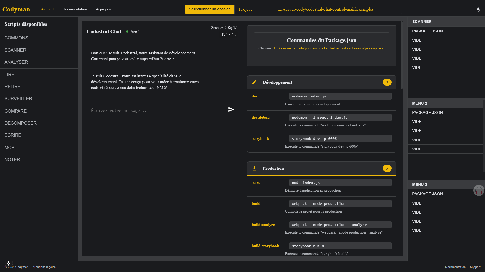
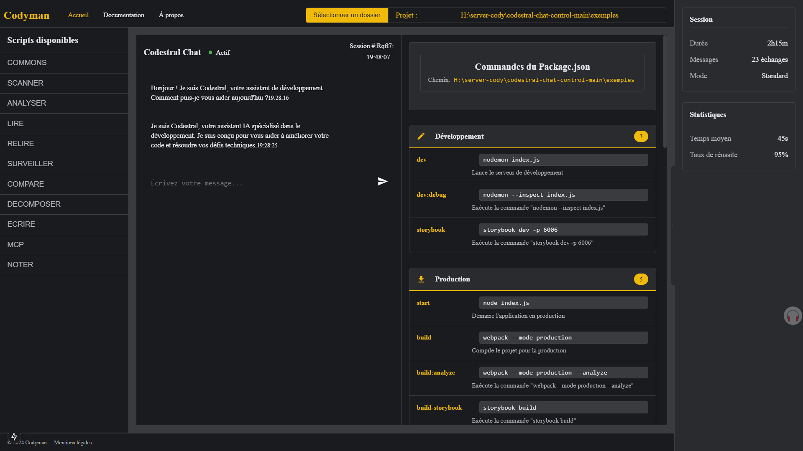

# Codestral Chat Control 🚀

> Un centre de contrôle intelligent pour vos projets Node.js/JavaScript. Codestral agit comme un agent de supervision entre votre assistant IA et votre code, garantissant une gestion sécurisée et optimisée de vos projets.

## 🎯 Vision

Codestral est né d'une vision simple : permettre aux développeurs de garder le contrôle total sur leurs projets tout en profitant pleinement de la puissance des assistants IA (Cline, RootCline, Cursor, Windsurf, etc.). Notre solution agit comme un intermédiaire intelligent, analysant et supervisant chaque action pour garantir l'intégrité de votre code.

> 🚧 **Projet en Développement Actif** 🚧
>
> Codestral est actuellement en phase de développement intense. Nous travaillons d'arrache-pied pour créer une expérience exceptionnelle ! Si vous souhaitez participer à cette aventure, n'hésitez pas à nous rejoindre. Chaque contribution compte pour façonner l'avenir de Codestral.
>
> - 📅 Version Alpha prévue : Mai 2025
> - 🔄 Mises en place régulières
> - 🤝 Ouvert aux contributions et suggestions
> - 🌟 Pour l'instant, je suis seul sur le projet, mais je compte sur vous pour m'aider à le faire évoluer.

  
*Centre de contrôle Codestral - Vue d'ensemble*


  
*Analyse détaillée et supervision des actions*


## ✨ Points Forts

### 🛡️ Supervision Intelligente
- Analyse en temps réel des actions de l'IA
- Validation automatique des modifications proposées
- Protection contre les changements non désirés
- Historique détaillé des interventions

### 🔍 Analyse Complète
- Scanner de dépendances et scripts
- Analyse de structure et architecture
- Détection des bonnes pratiques
- Métriques et rapports détaillés

### 💡 Optimisation Continue
- Suggestions d'amélioration contextuelles
- Détection des dépendances obsolètes
- Recommandations de sécurité
- Guide des meilleures pratiques

## 🏗️ Architecture

```
src/
├── app/
│   ├── components/    # Interface utilisateur modulaire
│   ├── services/      # Logique métier et analyses
│   └── styles/        # Thèmes et styles globaux
```

## 🤝 Rejoignez l'Aventure

Nous accueillons chaleureusement les contributions de la communauté francophone ! Voici comment participer :

- 🐛 Signalez les bugs
- 💡 Proposez des fonctionnalités
- 🔧 Soumettez des pull requests
- 📚 Améliorez la documentation

> Pour contribuer, consultez notre [guide de contribution](CONTRIBUTING.md)

## 📢 Communauté

- 💬 [Discord](https://discord.gg/codestral)
- 🐦 [Twitter](https://twitter.com/codestral)
- 📝 [Blog](https://codestral.dev/blog)

## 📄 Licence

Codestral est disponible sous licence MIT. Pour plus de détails, consultez le fichier [LICENSE.md](LICENSE.md).

---

<div align="center">

**[Documentation](https://docs.codestral.dev)** • **[Démarrage Rapide](https://docs.codestral.dev/quickstart)** • **[Exemples](https://docs.codestral.dev/examples)**

</div>
